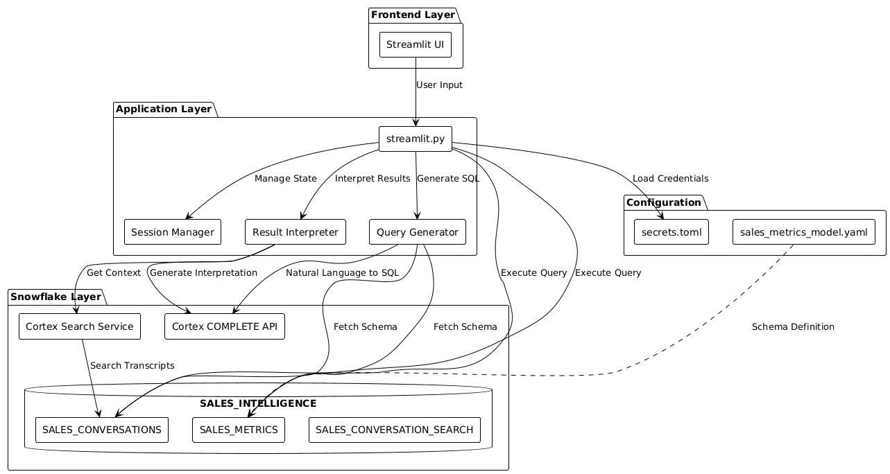
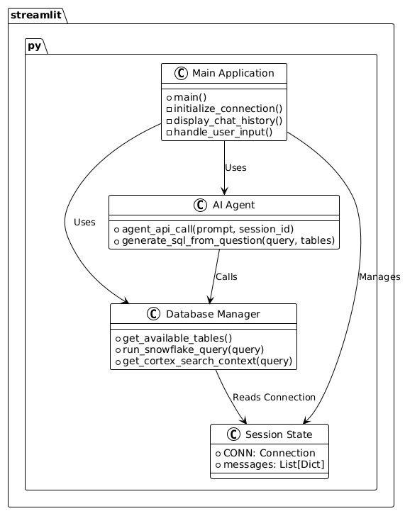
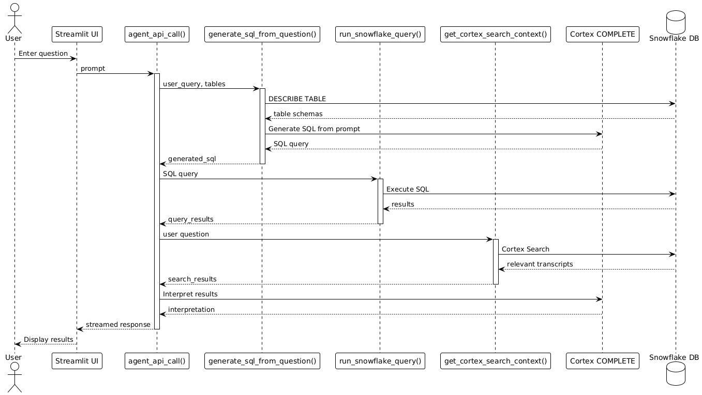
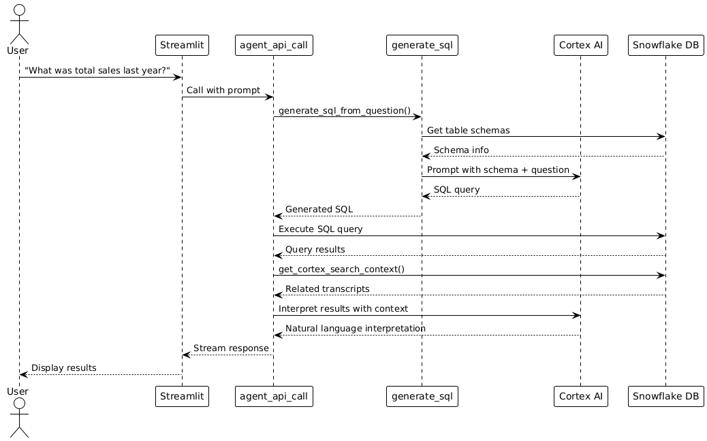

# Snowflake Cortex Agent - Detailed Code Structure Guide

## Table of Contents
1. [Architecture Overview](#architecture-overview)
2. [Component Details](#component-details)
3. [Data Flow](#data-flow)
4. [Setup Instructions](#setup-instructions)
5. [Testing Guide](#testing-guide)
6. [Development Guidelines](#development-guidelines)

## Architecture Overview

This application is an Intelligent Sales Assistant built using Snowflake's Cortex AI capabilities and Streamlit for the frontend. It allows users to ask natural language questions about sales data and get AI-generated SQL queries with interpreted results.

### High-Level Architecture Diagram



### Component Architecture Diagram



### Data Flow Diagram



### Sequence Diagram: User Query Flow



## Component Details

### 1. streamlit.py - Main Application File

This is the core application file containing all the logic. Let's break it down:

#### A. Configuration Constants

```python
HOST = st.secrets["snowflake"]["host"]
ACCOUNT = st.secrets["snowflake"]["account"]
USER = st.secrets["snowflake"]["user"]
PASSWORD = st.secrets["snowflake"]["password"]
ROLE = st.secrets["snowflake"]["role"]
WAREHOUSE = "SALES_INTELLIGENCE_WH"
DATABASE = "SALES_INTELLIGENCE"
SCHEMA = "DATA"
CORTEX_SEARCH_SERVICES = "SALES_INTELLIGENCE.DATA.SALES_CONVERSATION_SEARCH"
SEMANTIC_MODELS = "sales_intelligence.data.models/sales_metrics_model.yaml"
```

**Purpose**: These constants define the Snowflake connection parameters and service locations.

**Key Points**:
- Credentials are loaded from `.streamlit/secrets.toml` (never hardcoded)
- Database and schema names match those created in `setup.sql`
- Cortex Search Service name references the search index created on transcripts

#### B. get_available_tables()

```python
def get_available_tables():
    """Get list of available tables in the schema"""
```

**Purpose**: Retrieves all tables from the specified Snowflake schema.

**Flow**:
1. Gets cursor from session state connection
2. Sets database and schema context
3. Executes `SHOW TABLES` command
4. Returns list of table names

**Usage**: Called to show available tables in sidebar and for SQL generation.

#### C. run_snowflake_query(query)

```python
def run_snowflake_query(query):
```

**Purpose**: Executes a SQL query against Snowflake and returns results.

**Flow**:
1. Gets cursor with DictCursor (returns results as dictionaries)
2. Sets database and schema context
3. Removes semicolons from query (security measure)
4. Executes query
5. Fetches all results
6. Returns results or None on error

**Security Note**: Removes semicolons to prevent SQL injection through query chaining.

#### D. get_cortex_search_context(query)

```python
def get_cortex_search_context(query: str):
    """Get relevant context from Cortex Search Service"""
```

**Purpose**: Searches through sales conversation transcripts using Cortex Search.

**Flow**:
1. Escapes special characters in the query
2. Calls `SNOWFLAKE.CORTEX.SEARCH_PREVIEW()` function
3. Passes query with limit of 5 results
4. Returns search results as list

**How Cortex Search Works**:
- Uses semantic search (meaning-based, not just keyword matching)
- Searches the `transcript_text` field in sales conversations
- Returns most relevant conversation excerpts

#### E. generate_sql_from_question(user_query, tables)

```python
def generate_sql_from_question(user_query: str, tables: list):
    """Use Cortex to generate SQL from natural language question"""
```

**Purpose**: Converts natural language questions into SQL queries using AI.

**Flow**:
1. Retrieves schema information for all tables
2. Builds a detailed prompt with:
   - Table names
   - Column names and types
   - User's question
   - Instructions for proper SQL generation
3. Calls `SNOWFLAKE.CORTEX.COMPLETE()` with 'mistral-large2' model
4. Cleans up the response (removes markdown formatting)
5. Returns generated SQL

**Example Transformation**:
- Input: "What was total sales last year?"
- Output: `SELECT SUM(DEAL_VALUE) FROM SALES_METRICS WHERE YEAR(CLOSE_DATE) = 2024`

#### F. agent_api_call(prompt, session_id)

```python
def agent_api_call(prompt: str, session_id: str):
    """Generator function that makes Cortex Agent call using COMPLETE function"""
```

**Purpose**: Main orchestrator function that handles the entire query workflow.

**This is a Generator Function** - it yields results incrementally for streaming.

**Flow**:
1. **Get Available Tables** - Retrieves list of tables
2. **Generate SQL** - Converts question to SQL using AI
3. **Execute Query** - Runs the generated SQL
4. **Get Search Context** - Finds relevant conversation transcripts
5. **Generate Interpretation** - Creates natural language explanation of results

**Streaming Behavior**:
```python
yield "🔍 Analyzing your question...\n\n"
# ... process ...
yield f"📝 **Generated SQL Query:**\n```sql\n{generated_sql}\n```\n\n"
# ... process ...
yield "💡 **Interpretation:**\n\n"
```

This creates a real-time, progressive display of results to the user.

#### G. main()

```python
def main():
```

**Purpose**: Entry point of the Streamlit application.

**Flow**:
1. **Sidebar Setup**:
   - Display connection information
   - Show available tables
   - Add "Reset Conversation" button

2. **Connection Management**:
   - Check if connection exists in session state
   - Create new connection if needed
   - Handle connection errors

3. **Session State Initialization**:
   - Initialize message history list

4. **Display Chat History**:
   - Loop through stored messages
   - Display each message with appropriate role (user/assistant)

5. **Handle User Input**:
   - Capture input from chat input box
   - Add user message to display and history
   - Call `agent_api_call()` as generator
   - Stream response to UI using `st.write_stream()`
   - Save assistant response to history

### 2. setup.sql - Database Setup Script

This SQL script creates and populates the Snowflake database.

#### Structure:

```sql
-- 1. Create database and schema
CREATE OR REPLACE DATABASE sales_intelligence;
CREATE OR REPLACE SCHEMA sales_intelligence.data;
CREATE OR REPLACE WAREHOUSE sales_intelligence_wh;

-- 2. Create tables
CREATE TABLE sales_conversations (...);
CREATE TABLE sales_metrics (...);

-- 3. Insert sample data
INSERT INTO sales_conversations VALUES (...);
INSERT INTO sales_metrics VALUES (...);

-- 4. Enable change tracking
ALTER TABLE sales_conversations SET CHANGE_TRACKING = TRUE;

-- 5. Create Cortex Search Service
CREATE OR REPLACE CORTEX SEARCH SERVICE sales_conversation_search
  ON transcript_text
  ATTRIBUTES customer_name, deal_stage, sales_rep
  WAREHOUSE = sales_intelligence_wh
  TARGET_LAG = '1 hour'
  AS (...);

-- 6. Create stage for models
CREATE OR REPLACE STAGE models DIRECTORY = (ENABLE = TRUE);
```

#### Key Components:

**sales_conversations table**:
- Stores detailed call transcripts
- Contains rich text data for semantic search
- Includes metadata (customer, deal stage, rep, date, value)

**sales_metrics table**:
- Stores structured deal data
- Win/loss status
- Financial metrics
- Timeline data

**Cortex Search Service**:
- Indexes conversation transcripts
- Enables semantic search
- Updates every hour (`TARGET_LAG = '1 hour'`)
- Searches on `transcript_text` field
- Returns attributes for context

### 3. sales_metrics_model.yaml - Semantic Model

This YAML file defines the semantic layer for the data model.

```yaml
name: sales_metrics
description: Sales metrics and analytics model
tables:
  - name: SALES_METRICS
    base_table:
      database: SALES_INTELLIGENCE
      schema: DATA
      table: SALES_METRICS
    dimensions: [...]
    time_dimensions: [...]
    measures: [...]
```

#### Purpose:
- Provides metadata about the data model
- Defines synonyms for natural language queries
- Describes business meaning of columns
- Includes sample values for context

#### Structure:

**Dimensions**: Categorical fields
- DEAL_ID, CUSTOMER_NAME, SALES_STAGE, etc.
- Each has synonyms (e.g., "client", "buyer" for CUSTOMER_NAME)

**Time Dimensions**: Date/time fields
- CLOSE_DATE with synonyms like "completion date", "sale date"

**Measures**: Numeric metrics
- DEAL_VALUE with synonyms like "revenue", "sale_amount"

### 4. Test Files

#### tests/test_streamlit_app.py
```python
def test_streamlit_app_functionality():
    assert True  # Placeholder
```

Currently contains placeholder tests that need to be implemented.

#### tests/test_database.py
```python
def test_database_interaction():
    assert True  # Placeholder
```

Placeholder for database interaction tests.

### 5. Configuration Files

#### .streamlit/secrets.toml
Stores Snowflake connection credentials (not checked into git):
```toml
[snowflake]
account = "your_account"
user = "your_user"
password = "your_password"
role = "your_role"
host = "your_host"
```

#### pytest.ini
Configures pytest behavior:
```ini
[pytest]
addopts = -v --tb=short
testpaths = tests
python_files = test_*.py
```

#### requirements.txt
Production dependencies:
- streamlit: Web framework
- snowflake-connector-python: Database connector
- requests: HTTP library
- sseclient: Server-sent events client

#### requirements-dev.txt
Development dependencies:
- pytest: Testing framework
- pytest-cov: Coverage reporting
- pytest-mock: Mocking utilities

## Data Flow

Let's trace a complete user query through the system:

### Example: "What was the total sales volume last year?"

**Step 1: User Input**
```
User types: "What was the total sales volume last year?"
↓
Streamlit captures input
↓
Calls agent_api_call(prompt="What was the total sales volume last year?", session_id="session_1")
```

**Step 2: Get Available Tables**
```
agent_api_call() calls get_available_tables()
↓
Executes: SHOW TABLES
↓
Returns: ["SALES_CONVERSATIONS", "SALES_METRICS"]
```

**Step 3: Generate SQL**
```
Calls generate_sql_from_question("What was the total sales volume last year?", tables)
↓
Gets table schemas:
  SALES_METRICS: DEAL_ID, CUSTOMER_NAME, DEAL_VALUE, CLOSE_DATE, ...
↓
Builds prompt:
  "You are a SQL expert. Generate SQL query...
   Database Schema:
   Table: SALES_METRICS
   Columns: DEAL_ID (VARCHAR), DEAL_VALUE (FLOAT), CLOSE_DATE (DATE)...
   User Question: What was the total sales volume last year?"
↓
Calls Cortex COMPLETE with 'mistral-large2'
↓
Returns: "SELECT SUM(DEAL_VALUE) AS total_sales FROM SALES_METRICS WHERE YEAR(CLOSE_DATE) = 2024"
```

**Step 4: Execute SQL**
```
Calls run_snowflake_query(generated_sql)
↓
Executes: SELECT SUM(DEAL_VALUE) AS total_sales FROM SALES_METRICS WHERE YEAR(CLOSE_DATE) = 2024
↓
Returns: [{"total_sales": 840000}]
```

**Step 5: Get Search Context**
```
Calls get_cortex_search_context("What was the total sales volume last year?")
↓
Executes: CORTEX.SEARCH_PREVIEW with query
↓
Returns: [] (no relevant conversations)
```

**Step 6: Generate Interpretation**
```
Builds interpretation prompt:
  "Based on the SQL query results below...
   Query Results: 1. {"total_sales": 840000}
   Provide natural language summary..."
↓
Calls Cortex COMPLETE
↓
Returns: "The total sales volume for last year was $840,000. This represents
         the sum of all deal values that were closed in 2024..."
```

**Step 7: Stream to User**
```
Yields results in chunks:
  "🔍 Analyzing your question..."
  "📝 Generated SQL Query: SELECT SUM(DEAL_VALUE)..."
  "⚙️ Executing query..."
  "📊 Query Results: Found 1 rows..."
  "💡 Interpretation: The total sales volume..."
```

## Setup Instructions

See the [Building on Windows](#building-on-windows) section below.

## Testing Guide

See the [Testing Guide](#testing-your-code) section below.

## Development Guidelines

### Adding New Features

1. **New Database Function**:
   - Add function to `streamlit.py`
   - Use existing cursor pattern
   - Handle errors gracefully
   - Add docstring

2. **New AI Capability**:
   - Use `SNOWFLAKE.CORTEX.COMPLETE()` pattern
   - Escape user input properly
   - Build clear prompts
   - Handle response parsing

3. **New UI Component**:
   - Follow Streamlit patterns
   - Use session state for persistence
   - Add to sidebar or main area
   - Maintain chat-like interface

### Code Organization Tips

- Keep connection management in session state
- Use generator functions for streaming
- Separate concerns (DB, AI, UI)
- Add error handling everywhere
- Use type hints where possible

### Best Practices

1. **Security**:
   - Never commit `secrets.toml`
   - Escape SQL inputs
   - Validate user input
   - Use parameterized queries where possible

2. **Performance**:
   - Cache Snowflake connections
   - Limit search results
   - Use generators for streaming
   - Close cursors after use

3. **User Experience**:
   - Show progress indicators
   - Stream results for responsiveness
   - Display SQL for transparency
   - Handle errors gracefully

4. **Testing**:
   - Mock Snowflake connections
   - Test each function independently
   - Test error cases
   - Test with various inputs

---

## Building on Windows

### Prerequisites

1. **Python 3.8 or higher**
   - Download from [python.org](https://www.python.org/downloads/)
   - During installation, check "Add Python to PATH"
   - Verify installation:
     ```powershell
     python --version
     ```

2. **Git** (optional, for cloning)
   - Download from [git-scm.com](https://git-scm.com/)
   - Verify installation:
     ```powershell
     git --version
     ```

3. **Snowflake Account**
   - Sign up at [signup.snowflake.com](https://signup.snowflake.com/)
   - Note down your account details

### Step-by-Step Setup

#### Step 1: Clone or Download the Repository

**Option A: Using Git**
```powershell
git clone <repository-url>
cd cortex-agent-api-demo
```

**Option B: Download ZIP**
- Download the repository as ZIP
- Extract to a folder like `C:\Projects\cortex-agent-api-demo`
- Open PowerShell and navigate to that folder

#### Step 2: Create Virtual Environment

```powershell
# Create virtual environment
python -m venv venv

# Activate it
.\venv\Scripts\Activate.ps1
```

**If you get an execution policy error**, run:
```powershell
Set-ExecutionPolicy -ExecutionPolicy RemoteSigned -Scope CurrentUser
```

#### Step 3: Install Dependencies

```powershell
# Install production dependencies
pip install -r requirements.txt

# Install development dependencies (for testing)
pip install -r requirements-dev.txt
```

#### Step 4: Setup Snowflake Database

1. **Log into Snowflake**:
   - Go to your Snowflake account URL
   - Navigate to `Projects` → `Worksheets`
   - Click `Create SQL Worksheet`

2. **Run Setup Script**:
   - Open [`setup.sql`](setup.sql) in your text editor
   - Copy the entire contents
   - Paste into the Snowflake worksheet
   - Click "Run All" or press `Ctrl+Enter`
   - Wait for all steps to complete (may take 2-3 minutes)

3. **Upload Semantic Model**:
   - In Snowflake, go to `Data` → `Add Data` → `Load files into a Stage`
   - Upload [`sales_metrics_model.yaml`](sales_metrics_model.yaml)
   - Select:
     - Database: `SALES_INTELLIGENCE`
     - Schema: `DATA`
     - Stage: `MODELS`
   - Click "Upload"

#### Step 5: Configure Secrets

1. **Create `.streamlit` folder** (if it doesn't exist):
   ```powershell
   mkdir .streamlit
   ```

2. **Create `secrets.toml` file**:
   ```powershell
   New-Item -Path ".\.streamlit\secrets.toml" -ItemType File
   ```

3. **Get Snowflake Connection Details**:
   - In Snowflake, click your name (bottom left)
   - Select "Connect a tool to Snowflake"
   - Note down the details

4. **Edit `secrets.toml`**:
   Open `.streamlit\secrets.toml` in a text editor and add:
   ```toml
   [snowflake]
   account = "your_account_identifier"
   user = "your_username"
   password = "your_password"
   role = "your_role"
   host = "your_account_url.snowflakecomputing.com"
   ```

   **Replace** the placeholder values with your actual Snowflake credentials.

   **Example**:
   ```toml
   [snowflake]
   account = "abc12345.us-east-1"
   user = "JOHN_DOE"
   password = "MySecureP@ssw0rd!"
   role = "ACCOUNTADMIN"
   host = "abc12345.us-east-1.snowflakecomputing.com"
   ```

#### Step 6: Run the Application

```powershell
streamlit run streamlit.py
```

Your default browser should open automatically to `http://localhost:8501`.

**If it doesn't open**, manually navigate to: `http://localhost:8501`

#### Step 7: Test the Application

Try these sample queries in the chat interface:

1. **SQL Generation Test**:
   ```
   What was the total sales volume last year?
   ```
   Expected: SQL query generation + results + interpretation

2. **Search Test**:
   ```
   Summarize the call with TechCorp Inc
   ```
   Expected: Summary of the conversation transcript

3. **Complex Query Test**:
   ```
   Which sales rep had the highest deal value?
   ```
   Expected: SQL query + results showing the top sales rep

### Troubleshooting

#### Error: "Module not found"
```powershell
# Ensure virtual environment is activated
.\venv\Scripts\Activate.ps1

# Reinstall dependencies
pip install -r requirements.txt
```

#### Error: "Connection not established"
- Check your `secrets.toml` file
- Verify Snowflake credentials
- Ensure Snowflake account is active
- Check firewall settings

#### Error: "Table not found"
- Verify `setup.sql` was run completely
- Check database and schema names in Snowflake
- Ensure you have proper permissions

#### Port already in use
```powershell
# Run on a different port
streamlit run streamlit.py --server.port 8502
```

---

## Testing Your Code

### Running Existing Tests

#### Run All Tests
```powershell
# Ensure virtual environment is activated
.\venv\Scripts\Activate.ps1

# Run all tests
pytest
```

#### Run with Coverage
```powershell
# Run tests with coverage report
pytest --cov=. --cov-report=html
```

This creates an HTML coverage report in the `htmlcov/` directory.

#### View Coverage Report
```powershell
# Open in default browser
start htmlcov\index.html
```

#### Run Specific Test File
```powershell
# Test streamlit app
pytest tests\test_streamlit_app.py

# Test database
pytest tests\test_database.py
```

#### Run with Verbose Output
```powershell
pytest -v
```

### Current Test Status

The current tests are **placeholders** and need to be implemented:

**[`tests/test_streamlit_app.py`](tests/test_streamlit_app.py)**:
```python
def test_streamlit_app_functionality():
    assert True  # Replace with actual test logic

def test_another_feature():
    assert True  # Replace with actual test logic
```

**[`tests/test_database.py`](tests/test_database.py)**:
```python
def test_database_interaction():
    assert True  # Replace with actual tests
```

### Adding New Test Cases

#### Step 1: Understand the Test Structure

Tests are organized in the `tests/` directory:
```
tests/
├── test_streamlit_app.py    # Tests for Streamlit UI and application logic
└── test_database.py          # Tests for database interactions
```

#### Step 2: Create a New Test File

If you need a new test category:

```powershell
# Create new test file
New-Item -Path "tests\test_agent.py" -ItemType File
```

#### Step 3: Write Test Functions

**Basic Test Template**:
```python
# filepath: tests/test_agent.py
import pytest
from unittest.mock import Mock, patch

def test_function_name():
    """Test description"""
    # Arrange
    expected = "expected_value"
    
    # Act
    result = function_to_test()
    
    # Assert
    assert result == expected
```

#### Step 4: Example - Testing Database Functions

Let's implement real tests for [`tests/test_database.py`](tests/test_database.py):

````python
// filepath: [test_database.py](http://_vscodecontentref_/0)
import pytest
from unittest.mock import Mock, patch, MagicMock
import sys
import os

# Add parent directory to path for imports
sys.path.insert(0, os.path.abspath(os.path.join(os.path.dirname(__file__), '..')))

@pytest.fixture
def mock_snowflake_connection():
    """Fixture to create a mock Snowflake connection"""
    with patch('snowflake.connector.connect') as mock_connect:
        mock_conn = MagicMock()
        mock_cursor = MagicMock()
        mock_conn.cursor.return_value = mock_cursor
        mock_connect.return_value = mock_conn
        yield mock_conn, mock_cursor

@pytest.fixture
def mock_streamlit_session():
    """Fixture to mock Streamlit session state"""
    with patch('streamlit.session_state') as mock_session:
        mock_conn = MagicMock()
        mock_session.CONN = mock_conn
        yield mock_session

def test_get_available_tables(mock_streamlit_session):
    """Test retrieving available tables from Snowflake"""
    from streamlit import get_available_tables
    
    # Arrange
    mock_cursor = MagicMock()
    mock_streamlit_session.CONN.cursor.return_value = mock_cursor
    mock_cursor.fetchall.return_value = [
        {'name': 'SALES_METRICS'},
        {'name': 'SALES_CONVERSATIONS'}
    ]
    
    # Act
    tables = get_available_tables()
    
    # Assert
    assert len(tables) == 2
    assert 'SALES_METRICS' in tables
    assert 'SALES_CONVERSATIONS' in tables
    mock_cursor.execute.assert_called()

def test_run_snowflake_query_success(mock_streamlit_session):
    """Test successful SQL query execution"""
    from streamlit import run_snowflake_query
    
    # Arrange
    mock_cursor = MagicMock()
    mock_streamlit_session.CONN.cursor.return_value = mock_cursor
    mock_cursor.fetchall.return_value = [
        {'DEAL_VALUE': 75000, 'CUSTOMER_NAME': 'TechCorp Inc'}
    ]
    query = "SELECT DEAL_VALUE, CUSTOMER_NAME FROM SALES_METRICS"
    
    # Act
    results = run_snowflake_query(query)
    
    # Assert
    assert results is not None
    assert len(results) == 1
    assert results[0]['DEAL_VALUE'] == 75000

def test_run_snowflake_query_removes_semicolon(mock_streamlit_session):
    """Test that semicolons are removed from queries"""
    from streamlit import run_snowflake_query
    
    # Arrange
    mock_cursor = MagicMock()
    mock_streamlit_session.CONN.cursor.return_value = mock_cursor
    query = "SELECT * FROM SALES_METRICS;"
    
    # Act
    run_snowflake_query(query)
    
    # Assert
    # Verify that execute was called without semicolon
    call_args = mock_cursor.execute.call_args_list
    assert ';' not in str(call_args)

def test_get_cortex_search_context(mock_streamlit_session):
    """Test Cortex search context retrieval"""
    from streamlit import get_cortex_search_context
    import json
    
    # Arrange
    mock_cursor = MagicMock()
    mock_streamlit_session.CONN.cursor.return_value = mock_cursor
    search_results_json = json.dumps({
        'results': [
            {'content': 'TechCorp conversation...', 'score': 0.95},
            {'content': 'SecureBank conversation...', 'score': 0.87}
        ]
    })
    mock_cursor.fetchone.return_value = {'SEARCH_RESULTS': search_results_json}
    
    # Act
    results = get_cortex_search_context("TechCorp deal")
    
    # Assert
    assert len(results) == 2
    assert 'TechCorp' in results[0]['content']

def test_database_connection_error(mock_streamlit_session):
    """Test handling of database connection errors"""
    from streamlit import run_snowflake_query
    
    # Arrange
    mock_streamlit_session.CONN.cursor.side_effect = Exception("Connection failed")
    
    # Act
    results = run_snowflake_query("SELECT * FROM SALES_METRICS")
    
    # Assert
    assert results is None